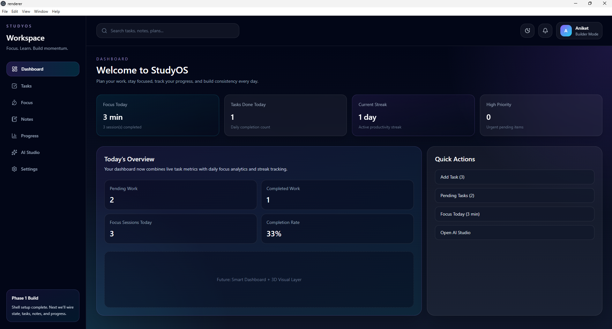
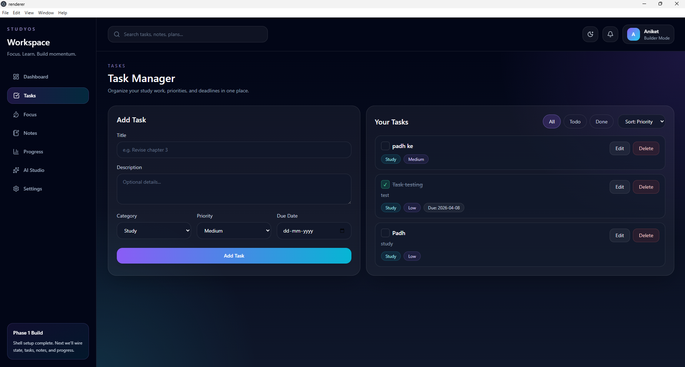
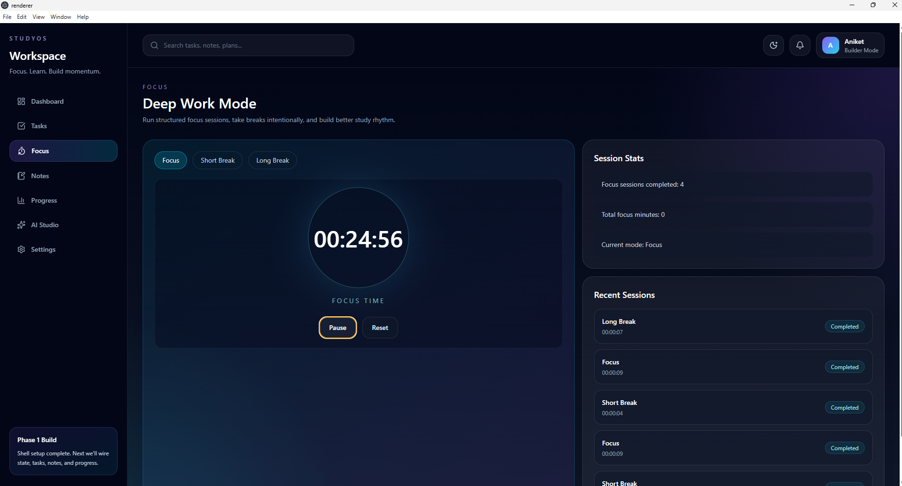
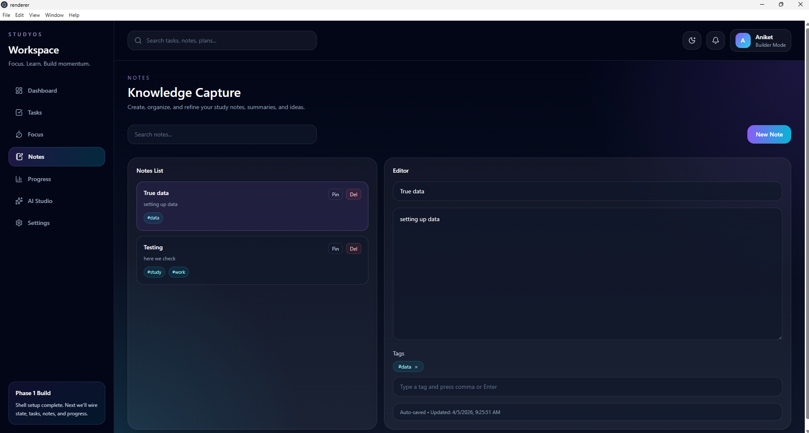
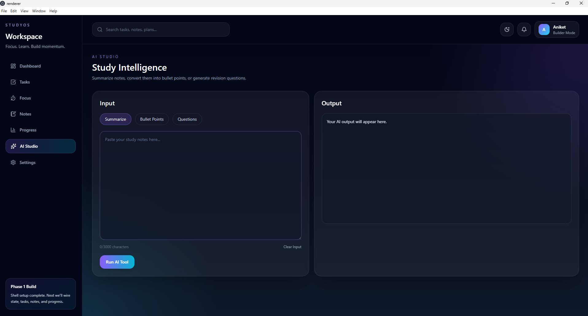
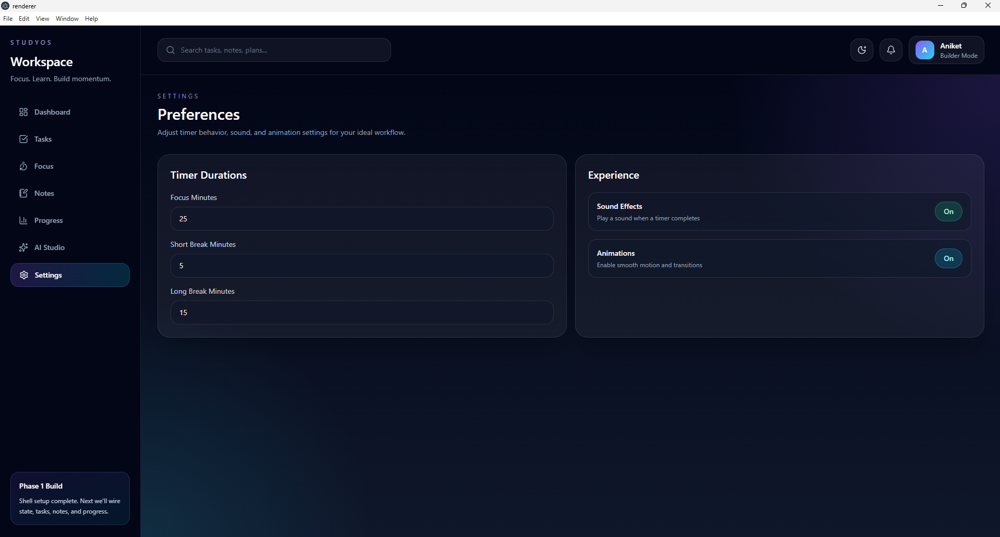

# 🚀 StudyOS — AI-Powered Study & Productivity Desktop App

StudyOS is a modern desktop productivity system designed for students and self-learners.
It combines task management, deep focus sessions, notes, analytics, and AI assistance into one seamless workflow.

---

## ✨ Features

### 🧠 Productivity Core

* Task Manager (Create, Edit, Prioritize, Track)
* Focus Timer (Pomodoro with auto-cycle + sound)
* Notes System (Tags, Pinning, Search, Split Editor)
* Daily Progress Tracking (Focus time, tasks, streaks)

---

### 🤖 AI Study Assistant

* Summarize notes instantly
* Convert notes into bullet points
* Generate revision questions
* Save AI output directly to Notes

---

### 📊 Intelligence Layer

* Dynamic Dashboard (real-time stats)
* Daily analytics (focus sessions, completion rate)
* Streak tracking system

---

### ⚙️ Customization

* Adjustable timer durations
* Toggle sound effects
* Enable/disable animations
* Persistent user preferences

---

### 🎨 Experience

* Smooth UI animations (Framer Motion)
* Modern UI (Tailwind CSS)
* Desktop-native experience (Electron)
* 3D dashboard visual (Three.js)

---

## 🛠️ Tech Stack

* Electron (Desktop App)
* React + TypeScript
* Tailwind CSS
* Zustand (State Management)
* Framer Motion (Animations)
* Three.js + React Three Fiber (3D UI)
* OpenAI API (AI features)

---

## 📸 Screenshots

### Dashboard

 

  

### Tasks

 

  

### Focus Timer

 

  

### Notes

 

  

### AI Studio

 

  

### Settings

 

  

---

## 🚧 Roadmap

* [ ] Chat-style AI interface
* [ ] Save AI history
* [ ] Export notes to PDF
* [ ] Cloud sync
* [ ] Mobile companion app

---

## 💡 Why StudyOS?

Most productivity tools are fragmented.

StudyOS combines:

* Planning
* Execution
* Reflection
* AI assistance

into one unified system.

---

## 🧑‍💻 Author

Built by Aniketh

---

## ⭐ If you like this project

Give it a star ⭐ — it helps a lot!
